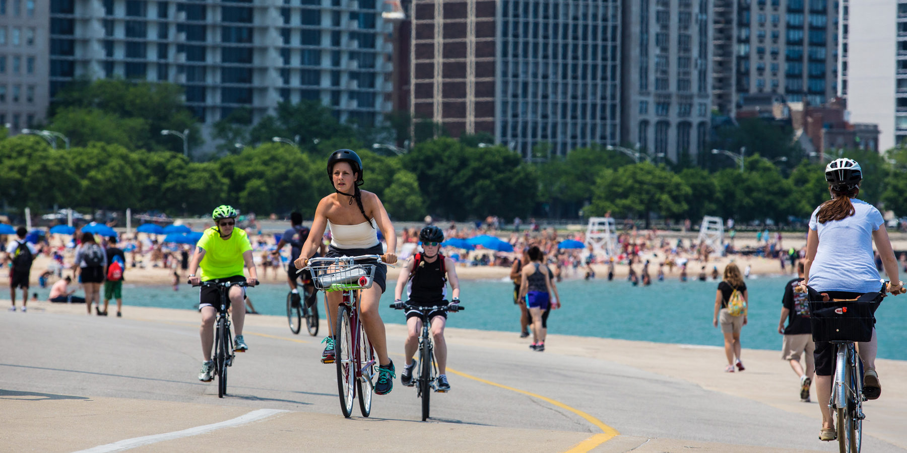

# Bike Safety in the Windy City - An analysis of severe bike crash contributors for Vision Zero Chicago

## *Predicting severity of bike crashes with Machine Learning Models*

<figure>
    
</figure>

Authors: John Nahra, Ryan Moore, Sean Conlon

Date: 3/10/2023

## Stakeholder: Vision Zero Chicago

<figure>
    
</figure>

Vision Zero Chicago (VZC) is the commitment and approach to eliminating fatalities and serious injuries from traffic crashes.

Vision Zero brings together the policies, partnerships, and technologies that prevent death and serious injury from traffic crashes. Traffic crashes are not “accidents.” We acknowledge that traffic deaths are preventable and unacceptable and commit to using all available tools to influence the conditions and behaviors that lead to serious crashes.

The engagement team has been hired to help with Vision Zero Chicago's mission by performing an analysis of bike-related accidents to determine circumstances that contribute to severe and fatal bike crashes.

## Data Overview and Filtering

<figure>
    
</figure>

The data we used is from the Chicago Data Portal, which shows information about each traffic crash on city streets within the City of Chicago limits and under the jurisdiction of the Chicago Police Department (CPD).

We utilized two sets of information:

- Crashes - Which detail individual crashes and their characteristics
- People - Which detail out each person involved in the crash

We started with the people dataset, filtered for bike-related crashes, and combined the other datasets on these individuals' vehicles for a complete picture of each crash related to bicycles.

## Data Paring and Binning

<figure>
    
</figure>

After our data were combined and filtered for bike-related accidents, we performed EDA on the dataset and investigated features that contained a large amount of blank values.

Certain columns with a very high amount of blank information were dropped, as the engagement team could not realistically impute the missing values given the variety and scarcity of existing values.

For features that contained characteristic data of the crash, many values needed to be binned so our modeling could more readily determine characteristics that contributed to severe injuries. For example, 'PEDPEDAL_ACTION' ranged from things such as walking in a crosswalk to biking against traffic; these were binned as 'Safe' and 'Unsafe' actions to generalize the data for modeling.

## Targeting and Sample Imbalance

<figure>
    
</figure>

For our target, we focused on the INJURY_CLASSIFICATION feature from the people dataset. Our predictive target would be binary and classified as a 1 or 0, with 1 representing a severe injury (incapacitating and above) and 0 representing a non-severe injury (anything less than an incapacitating injury).

Upon inspection of our target, we noted that our target information was greatly imbalanced towards non-severe injuries. To remedy this, we undersampled the majority class in order to balance our target for modeling, which rely on more balanced target variables.

## Machine Learning Pipeline

Once the train_test_split was performed on the data, our pipeline was as follows:

1. One Hot Encoding multi-categorical columns
3. Undersampling the majority class in the training set,
4. Fitting the models on the train set and evaluating the recall on both the train and test sets

Our key metric was recall, as our focus was to minimize false negatives (failing to predict severe injuries).

We utilized decision tree, random forest, and logistic regression models. The random forest model returned the highest recall on the test set and during cross-validation at around 54% and 52%, respectively.

## Results

Our results pointed us to five crash characteristics that contribute to a crash that results in a severe injury:

1. Driver impairment
2. Age
3. Posted speed limit
4. Safe biker action
5. Time of day

## Repo Structure

This is the README of the project. The repo contains our technical jupyter notebook (final_notebook.ipynb) which shows the code used to prepare, clean, and model the data. Our final non-technical presentation can be seen at presentation.pdf

